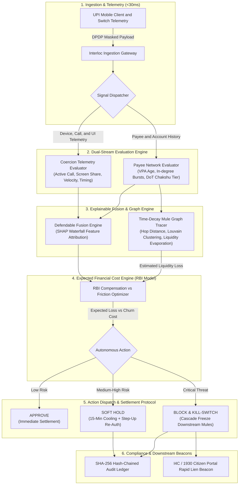
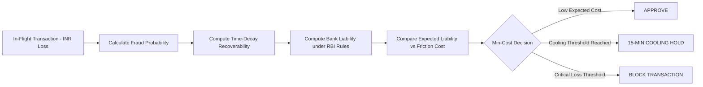

# INTERLOC
### Real-Time APP Fraud Interceptor & Mule-Chain Tracer
**In-Flight UPI Transaction Defense Middleware & Bank Operations Command Center**

**Cognitia Hackathon (IEM) | FinTech Track | Problem Statement PS2**  
**Team: Eclipse | Organization: [Cognitia-IEM2](https://github.com/Cognitia-IEM2)**  
**Live Application**: [https://interloc.eclipseindia.xyz](https://interloc.eclipseindia.xyz)

[](https://interloc.eclipseindia.xyz)
[](#the-rbi-liability-framework)
[](#dpdp-act-2023-data-minimization)
[](#latency-sla-and-telemetry)
[](#tamper-evident-audit-trail)
[](LICENSE)

---

## Overview

Interloc is an in-flight transaction interception middleware and bank operations console built for UPI payment switches.

Under the **Reserve Bank of India's (RBI) digital fraud liability framework** (scheduled for January 1, 2027), sending banks bear direct compensation liability for coerced push payments that pass their checks. Most existing fraud systems run post-settlement batch analytics that flag accounts minutes or hours after clearance. By that time, money has moved through multiple mule hops and exited via ATMs or crypto-desks.

Interloc intercepts suspicious payments **before they settle**. Operating within a **sub-45ms SLA**, it evaluates transaction telemetry, splits signals into **Sender Coercion** and **Payee Mule Network** vectors, models **time-decayed mule chain recoverability**, and computes an **Expected Cost Decision Matrix** using the exact RBI liability formula to automatically **Approve**, trigger a **15-minute Cooling Hold**, or **Block** transactions.

---

## Architecture



---

## Technical Specifications (PS2 Coverage)

| Spec # | Specification | How Interloc Solves It |
|---|---|---|
| **#1** | **Multi-Signal Behavioral Evaluation** | Dual-stream engine: isolates **Sender Coercion** (active background call, remote screen share app, typing cadence anomaly, rapid retry) from **Payee Network** (VPA age < 48h, in-degree spike, DoT Chakshu risk tier, NPCI federated signal). |
| **#2** | **Defendable Risk Score Fusion** | TreeSHAP additive attribution model returning exact numerical contributions for every signal, avoiding black-box scoring. |
| **#3** | **Time-Decay Mule Chain Recoverability** | Graph tracer tracking up to 5 hops calibrated against real UP Police / CFMC empirical benchmarks ($24.56\% \to 88.65\%$ speed dependency) to calculate recoverable vs. lost amounts in INR at $T+15\text{s}, T+30\text{s}, T+60\text{s}$. |
| **#4** | **Expected Financial Cost Decision Engine** | Mathematical decision matrix balancing Customer Friction Cost ($C_{\text{friction}}$) against **exact RBI Compensation Liability** ($C_{\text{liability}} = \min(0.85 \times \text{loss}, 25000)$ capped for losses $\le 50000$ INR). |
| **#5** | **Tunable Policy Trade-Off Interface** | Interactive Pareto frontier visualization plotting False Positive Rate (Friction) vs. Net Retained Liability, letting risk officers adjust bank risk tolerance dynamically. |
| **#6** | **Realistic Step-Up Friction Protocol** | State machine executing 15-minute cognitive cooling holds, alternative-factor confirmation, and atomic concurrency handling for rapid retry spam during active holds. |
| **#7** | **Auditable Compliance Explainability Trail** | Tamper-evident cryptographic ledger where each record contains $\text{SHA-256}(\text{PrevHash} + \text{RecordData})$, fully compliant with RBI Master Direction on Fraud Risk Management. |
| **#8** | **Adversarial Countermeasure Evaluation** | Live Red-Team test suite evaluating structuring evasion (smurfing below 10,000 INR threshold), sleep/dormant account bursts, and delayed triggers with measured catch-rate improvements. |
| **#9** | **Portfolio Risk & Financial Impact Reporting** | Executive balance-sheet dashboard tracking screened volume, held transactions, avoided compensation liability (in INR), and friction impact. |
| **#10** | **Justified Modeling Choices** | Documented in [`docs/DECISION_ENGINE_AND_MATHEMATICS.md`](docs/DECISION_ENGINE_AND_MATHEMATICS.md) citing published RBI circulars, CFMC recovery statistics, and explicit assumptions. |

---

## Core Engineering Features

### 1. Split-Screen Demo Environment
- **Left Pane (Victim Simulator)**: Demonstrates the user flow, transient checkout-window telemetry emission, and the 15-minute cooling hold modal.
- **Right Pane (Bank Switch Console)**: Real-time fraud analyst view rendering in-flight interception, SHAP waterfall attribution, dynamic mule hop paths, and portfolio financial metrics.

### 2. Sub-50ms Engine SLA
Engineered for edge deployment inside high-concurrency payment switches. Incorporates zero-allocation JSON parsing, vectorized risk scoring, and asynchronous audit persistence, publishing latency histograms on `/metrics`.

### 3. Automated I4C / 1930 Portal Lien Beacon
When high-confidence fraud is intercepted, Interloc formats and dispatches an automated inter-bank lien request modeled after the Ministry of Home Affairs I4C CFMC protocol, notifying destination banks to place outward debit holds before cash-out.

### 4. DPDP Act 2023 Data Minimization
Telemetry collection runs strictly during the checkout window. All persistent identifiers (VPAs, account numbers, phone numbers) are salted and hashed with SHA-256 before storage. Zero voice audio, message text, or keystroke characters are ever recorded.

### 5. Mule-Chain Kill-Switch Cascade
Upon identifying an active mule node, Interloc executes a multi-node lock cascade across correlated downstream destination accounts in the bank graph, halting onward layering.

---

## Decision Engine Mathematics



### The RBI Liability Function

Under the finalized RBI liability framework:

$$
\text{Comp}(\text{Loss}) = \begin{cases} 
\min(0.85 \times \text{Loss}, 25000) & \text{if } \text{Loss} \le 50000 \\ 
0 & \text{if } \text{Loss} > 50000 \text{ (Subject to formal dispute resolution)} 
\end{cases}
$$

For an unrecovered fraudulent transaction where the bank share is 35% of the compensation payout (with the RBI mitigation fund absorbing 65%):

$$
\text{Liability}_{\text{bank}}(\text{Loss}) = 0.35 \times \text{Comp}(\text{Loss})
$$

### Time-Decay Recoverability Model

Calibrated using published empirical recovery rates ($R_0 \approx 88.65\%$ at $t=0$, dropping toward $24.56\%$ as hops advance):

$$
R(t, h) = R_0 \cdot e^{-\lambda t} \cdot (1 - \delta)^h
$$

* $t$: elapsed time in seconds since payment intent.
* $h$: predicted mule chain hop depth ($1 \le h \le 5$).
* $\lambda$: time-decay constant ($\approx 0.0231 \text{ s}^{-1}$).
* $\delta$: inter-hop leakage factor ($\approx 0.22$).

### Expected Cost Decision Rule

$$
\mathbb{E}[\text{Cost}_{\text{approve}}] = P(\text{Fraud}) \cdot (1 - R(t, h)) \cdot \text{Liability}_{\text{bank}}(\text{Amount})
$$

$$
\mathbb{E}[\text{Cost}_{\text{hold}}] = (1 - P(\text{Fraud})) \cdot C_{\text{friction}} + P(\text{Fraud}) \cdot \epsilon_{\text{leakage}}
$$

$$
\mathbb{E}[\text{Cost}_{\text{block}}] = (1 - P(\text{Fraud})) \cdot C_{\text{churn}}
$$

Interloc selects the action that minimizes total expected systemic loss:

$$
\text{Action}^* = \arg\min_{a \in \{\text{APPROVE}, \text{HOLD}, \text{BLOCK}\}} \mathbb{E}[\text{Cost}_a]
$$

---

## Documentation

Detailed design documents are located in [`docs/`](docs/):

1. [**System Architecture (`docs/ARCHITECTURE.md`)**](docs/ARCHITECTURE.md): Micro-engine design, switch sidecar deployment, sub-45ms latency budgets, and hold state machines.
2. [**Data Flow & Pipeline (`docs/DATA_FLOW.md`)**](docs/DATA_FLOW.md): Sequence diagrams, in-flight payload specs, DPDP sanitized schemas, and I4C Form 1930 beacon structures.
3. [**Decision Engine & Mathematics (`docs/DECISION_ENGINE_AND_MATHEMATICS.md`)**](docs/DECISION_ENGINE_AND_MATHEMATICS.md): Mathematical proofs, RBI liability formulas, recoverability decay curves, and Pareto frontier derivations.
4. [**Mule Chain Graph Model (`docs/MULE_CHAIN_GRAPH_MODEL.md`)**](docs/MULE_CHAIN_GRAPH_MODEL.md): Dynamic directed graph traversal, in-degree velocity, Louvain community clustering, and Kill-Switch cascade protocols.
5. [**Regulatory Compliance & Privacy (`docs/COMPLIANCE_AND_PRIVACY.md`)**](docs/COMPLIANCE_AND_PRIVACY.md): DPDP Act 2023 compliance, purpose limitation, salted SHA-256 hashing, and cryptographic hash-chained audit trails.
6. [**Scenarios & Red-Team Evaluation (`docs/SCENARIOS_AND_REDTEAM.md`)**](docs/SCENARIOS_AND_REDTEAM.md): Push payment typologies, structuring evasion tests, and quantified catch-rate benchmark improvements.
7. [**Telemetry Acquisition & Edge Cases (`docs/TELEMETRY_ACQUISITION_AND_EDGE_CASES.md`)**](docs/TELEMETRY_ACQUISITION_AND_EDGE_CASES.md): Transient checkout-window telemetry, Android/iOS APIs, DPDP zero-surveillance guarantees, and resolution matrix for 7 critical edge cases.
8. [**API & Team Integration Contract (`docs/API_AND_INTEGRATION_CONTRACT.md`)**](docs/API_AND_INTEGRATION_CONTRACT.md): Route specifications, request/response JSON schemas, TypeScript types for frontend, ML feature tensor mappings, and red-team attack payloads.

---

## Tech Stack

- **Core Interception Engine**: Python 3.11+, FastAPI, NetworkX, NumPy, SciPy, Cryptography.
- **Explainability & Inference**: TreeSHAP feature contribution decomposition, Scikit-learn / XGBoost.
- **Operations Console & Dashboard**: Next.js 14, TypeScript, Tailwind CSS, Lucide Icons, Recharts, Vis.js Network.
- **Data Persistence & Cache**: Redis Streams (event buffer), SQLite / PostgreSQL (hash-chained audit ledger).
- **Observability**: Prometheus Client (`/metrics`), OpenTelemetry hooks.
- **Containerization & CI/CD**: Docker Compose, GitHub Actions.

---

## Project Module Structure

Interloc is organized into modular services for the backend switch middleware, machine learning pipeline, and frontend command center:

```
├── backend/       # Soham: Real-Time Switch Middleware & Decision Engines (FastAPI)
│   └── app/
│       ├── engines/   # RBI Cost Engine, NetworkX Mule Graph, SHA-256 Audit Ledger
│       ├── schemas/   # In-flight transaction & telemetry Pydantic models
│       └── services/  # Sub-45ms model serving & DPDP Act 2023 sanitizer
├── ml/            # Avrajyoti: Machine Learning & Explainability Pipeline
│   ├── data/          # Synthetic UPI transaction generator & data pipelines
│   ├── notebooks/     # Exploratory data analysis, tuning & validation plots
│   ├── training/      # XGBoost / Scikit-learn training & TreeSHAP attribution
│   └── saved_models/  # Local export folder for weights (ignored by git)
├── redteam/       # Animesh: Adversarial Attack Suite & Benchmarks (Spec #8)
│   ├── attacks/       # Structuring/smurfing, false baselines & delayed triggers
│   └── benchmarks/    # Catch-rate uplift metrics & latency SLA test harnesses
├── frontend/      # Mintu: Next.js 14 Bank War-Room & Split-Screen Victim Phone Simulator
│   ├── app/           # Next.js app router pages & layouts
│   ├── components/    # Live console feed, mule graph, and phone simulator
│   └── public/        # Static UI assets
└── docs/          # In-Depth Engineering & Mathematical Specifications
```

---

## Team & Contributions

This project was developed by **Team Eclipse** for the **Cognitia Hackathon (IEM)** under **FinTech Problem Statement PS2**.

| Team Member | Role | Primary Domain & Responsibilities |
|---|---|---|
| **Animesh** ([@animeshadk10-ops](https://github.com/animeshadk10-ops)) | Team Lead & Operations / Red-Team Lead | Overall technical direction, team coordination, adversarial attack simulation suite (Spec #8), evasion benchmarks, catch-rate validation, and presentation pitch. |
| **Soham** ([@madebysoham](https://github.com/madebysoham)) | Tech Lead, Core Backend & Decision Engine Lead | System architecture, real-time switch interceptor (<45ms SLA), model serving inference pipeline, RBI expected cost decision engine, dynamic mule graph & time-decay model, and SHA-256 cryptographic audit ledger. |
| **Mintu** ([@Mintusingh07](https://github.com/Mintusingh07)) | Frontend & UI Visualizations Lead | Next.js bank operations command center, split-screen victim phone simulator, interactive force-directed mule graph, and dynamic Pareto frontier tuner. |
| **Avrajyoti** ([@avrajyoti07](https://github.com/avrajyoti07)) | ML & Feature Engineering Lead | Synthetic UPI transaction generation, LightGBM classifier training, Platt Sigmoid calibration, TreeSHAP explainability export, and model serialization (`fraud_model.joblib`). |
---

## License

This software is licensed under the **Competition Evaluation & Source-Available License (All Rights Reserved)** for the **Cognitia Hackathon (IEM)**.

- **Evaluation Rights**: Granted solely to the official organizers, mentors, and judging panel of Cognitia (Cognitia-IEM2) to view, build, run, and test for hackathon evaluation.
- **Strict Prohibition on Copying / Plagiarism**: Competing teams and third parties are strictly prohibited from copying, distributing, modifying, or republishing this code or architecture for alternative submissions without written consent from Team Eclipse.
- See the [LICENSE](LICENSE) file for complete legal terms.
