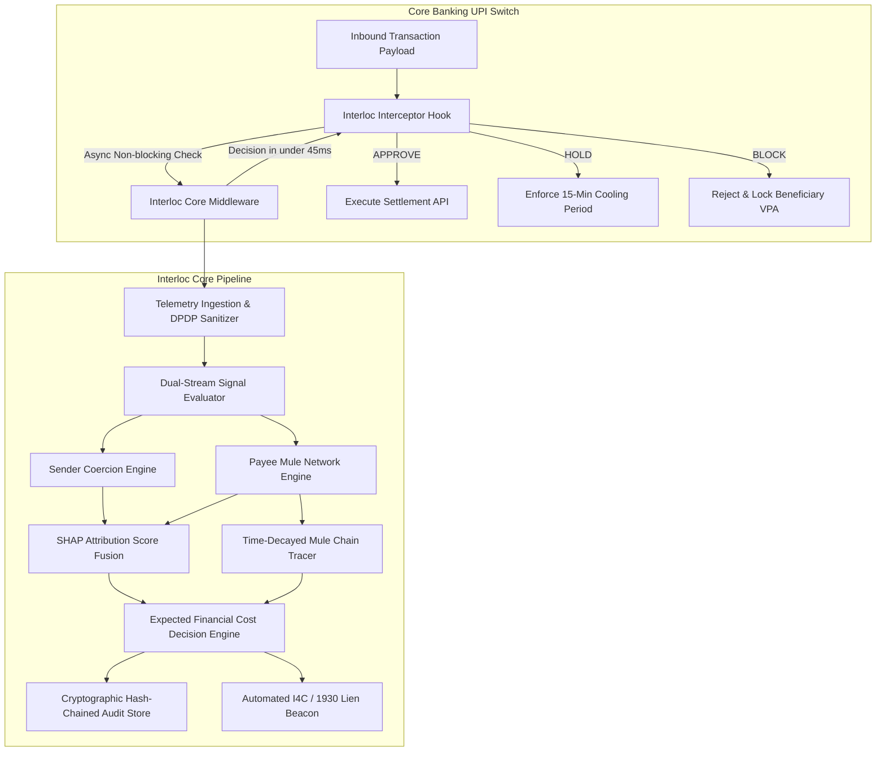
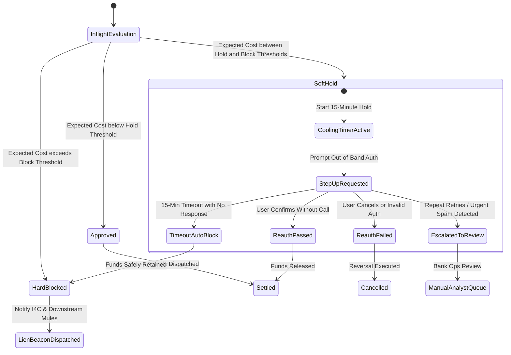

# Interloc System Architecture

## 1. High-Level Architectural Vision

Interloc operates as an **in-flight transaction interception middleware** integrated directly into a core banking UPI switch (or National Payments Corporation of India - NPCI member gateway). 

In payment ecosystems, once an Authorised Push Payment (APP) transaction settles, irrevocable liquidity transfer occurs across the immediate payment service (IMPS/UPI). Traditional Fraud Risk Management (FRM) systems run batch analytics post-settlement or asynchronous alerts that fire after several minutes. By that time, money has been layered through multiple mule accounts and cashed out at ATMs or converted into crypto-assets.

Interloc solves this by embedding an asynchronous, sub-50 millisecond decision pipeline directly into the payment authorization loop.

---

## 2. Latency Budget & Asynchronous Pipeline

UPI payment authorization has strict Service Level Agreements (SLAs), generally requiring the entire transaction lifecycle to complete within **1000ms** end-to-end, with the fraud inspection window capped at **< 100ms** to avoid timeout drops.

### Latency Budget Breakdown (Target: < 45ms)
* **Ingestion & DPDP Masking**: $3\text{ ms}$ (Payload parsing, VPA/phone hashing)
* **Coercion Signal Extraction**: $8\text{ ms}$ (In-memory rule & behavioral feature computation)
* **Payee Network & Graph Traversal**: $15\text{ ms}$ (Graph index lookup, hop distance calculation)
* **SHAP Score Fusion**: $7\text{ ms}$ (Fast tree-based inference & linear attribution)
* **Expected Cost Decision Matrix**: $4\text{ ms}$ (Closed-form RBI liability evaluation)
* **Audit Chaining & Dispatch**: $3\text{ ms}$ (SHA-256 state update)
* **Total Execution Time**: $\mathbf{\approx 40\text{ ms}}$ ($\le 50\text{ms}$ hard SLA budget)

```mermaid
gantt
    title Interloc Sub-50ms Processing Budget
    dateFormat X
    axisFormat %s ms
    section Ingestion
    DPDP Sanitization & Parsing :0, 3
    section Signal Evaluation
    Coercion Vector Evaluation :3, 11
    Payee Graph Hop Lookup     :3, 18
    section Decision Logic
    SHAP Fusion Inference      :18, 25
    Expected Cost Calculation  :25, 29
    section Persistence
    SHA-256 Hash Chain Append  :29, 32
    Response Serialization     :32, 35
```

---

## 3. Core Subsystems

### 3.1. Telemetry Ingestion & DPDP Sanitizer
* Ingests incoming UPI authorization payloads containing transaction details, device context, and user state.
* Implements a **Data Minimization Gateway** complying with Section 6 of India's **Digital Personal Data Protection (DPDP) Act 2023**:
  - Raw phone numbers and account numbers are immediately salted and hashed with SHA-256.
  - Telemetry features (e.g., active call status) are converted to normalized categorical flags without logging call metadata or content.

### 3.2. Dual-Stream Behavioral Evaluation Engine
Traditional systems lump all signals into one vector, losing the distinction between **victim vulnerability** and **attacker infrastructure**. Interloc separates them into two parallel streams:
1. **Stream 1: Victim Coercion Stream**
   - Active call state duration (e.g. user on call for >15 mins while authorizing).
   - Foreground accessibility / remote desktop utilities (e.g., screen share tools).
   - Abnormal typing velocity, hesitation jitter, and out-of-character transaction timing.
   - Micro-structuring below standard alerts (e.g., multiple transfers just under ₹10,000).
2. **Stream 2: Payee Mule Network Stream**
   - Beneficiary VPA age (e.g., created < 72 hours ago).
   - In-degree velocity spikes (e.g., 20 distinct incoming transfers in 2 hours).
   - High-risk registry flags (simulated DoT Chakshu / I4C national cybercrime registry tiers).

### 3.3. Defendable SHAP Score Fusion Engine
* Fuses the disparate signals into a unified fraud probability score $P(\text{Fraud}) \in [0, 1]$.
* Utilizes an additive attribution model where the output score equals a baseline expectation plus individual signal contributions:
  $$P(\text{Fraud}) = \sigma \left( \phi_0 + \sum_{i=1}^{M} \phi_i \right)$$
* Each signal $\phi_i$ has an auditable, quantifiable impact, satisfying regulatory demands for non-arbitrary scoring.

### 3.4. Dynamic Mule-Chain Graph Tracer
* Maintains a real-time directed transaction graph $G = (V, E)$, tracking money flows between senders, receivers, and onward intermediaries.
* Calculates **hop distance** to identified mule clusters and models **time-decay recoverability** based on real empirical benchmarks.
* Implements community detection (Louvain modularity) to flag coordinated smurfing syndicates.

### 3.5. Expected Cost Decision Engine (RBI Mandate)
* Instead of comparing $P(\text{Fraud})$ to an arbitrary static threshold (e.g., $0.7$), the engine computes the expected financial cost in Indian Rupees ($\text{INR}$).
* Incorporates the **RBI Digital Fraud Liability Compensation Framework** (payouts capped at 85% up to ₹25,000 for transactions $\le ₹50,000$, with a 65/35 RBI/Bank split).
* Compares Expected Regulatory Liability against Customer Friction Churn Cost to choose the mathematically optimal action:
  - **APPROVE**: Low expected fraud loss.
  - **SOFT HOLD (15-Min Cooling)**: Coercion suspected; triggers step-up verification and cooling-off period.
  - **BLOCK & CASCADE FREEZE**: High fraud certainty; halts transaction and locks downstream mule accounts.

### 3.6. Cryptographic Hash-Chained Audit Ledger
* Every decision generates an immutable audit record:
  $$\text{Record}_n = \{\text{ID}, \text{Timestamp}, \text{PayloadHash}, \text{Signals}, P(\text{Fraud}), \text{Action}, \text{PrevHash}\}$$
  $$\text{CurrentHash}_n = \text{SHA-256}(\text{Record}_n)$$
* Ensures complete non-repudiation and tamper detection for internal audit and RBI supervisory inspection.

### 3.7. Automated I4C / 1930 Citizen Portal Lien Dispatcher
* Generates an automated inter-bank lien beacon to notify the receiving bank and the Ministry of Home Affairs I4C portal to freeze downstream beneficiary accounts before physical ATM cash withdrawals can occur.

---

## 4. State Machine: Step-Up Friction & Active Hold Protocol

---

## 5. Deployment Topology

Interloc can be deployed in two enterprise topologies:

1. **In-Switch Sidecar (Edge Deployment)**:
   - High-performance Go / Rust / Python container deployed adjacent to the bank's UPI Switch connector.
   - Communicates via ultra-low latency gRPC or Unix domain sockets.
2. **Centralized Bank-Wide Risk Hub (Consortium Deployment)**:
   - Ingests feeds from UPI, NetBanking, and IMPS switches via high-throughput Kafka / Redis Streams.
   - Provides an enterprise dashboard for fraud operations analysts and compliance officers.
3. **Live Demonstration & Hackathon Topology**:
   - **Frontend Operations Console**: Hosted on Vercel Global Edge Network with custom domain `https://interloc.eclipseindia.xyz`.
   - **AI Interceptor Switch Core**: Hosted on high-performance cloud container runtime with dedicated memory, sub-45ms SLA processing, and persistent SQLite WAL ledger.

---

## 6. Implementation Module Reference Matrix

The architecture defined across this specification is implemented in the `backend/` directory:

| Subsystem / Architectural Component | Implementation File | Corresponding Design Document |
|---|---|---|
| Ingestion Gateway & App Server | `backend/app/main.py` | [docs/ARCHITECTURE.md](docs/ARCHITECTURE.md) (Section 1) |
| Configuration & Redis Fallback | `backend/app/config.py` | [docs/ARCHITECTURE.md](docs/ARCHITECTURE.md) (Section 2) |
| DPDP Act 2023 Salted PII Sanitizer | `backend/app/services/sanitizer.py` | [docs/COMPLIANCE_AND_PRIVACY.md](docs/COMPLIANCE_AND_PRIVACY.md) (Section 3) |
| Behavioral Coercion Evaluator | `backend/app/engines/coercion.py` | [docs/TELEMETRY_ACQUISITION_AND_EDGE_CASES.md](docs/TELEMETRY_ACQUISITION_AND_EDGE_CASES.md) |
| ML Model Bridge & SHAP Attribution | `backend/app/engines/ml_adapter.py` | [docs/API_AND_INTEGRATION_CONTRACT.md](docs/API_AND_INTEGRATION_CONTRACT.md) (Section 5) |
| RBI Liability & Pareto Cost Engine | `backend/app/engines/decision.py` | [docs/DECISION_ENGINE_AND_MATHEMATICS.md](docs/DECISION_ENGINE_AND_MATHEMATICS.md) |
| Dynamic Mule Multigraph & Kill-Switch | `backend/app/engines/graph.py` | [docs/MULE_CHAIN_GRAPH_MODEL.md](docs/MULE_CHAIN_GRAPH_MODEL.md) |
| Cryptographic Hash-Chained Audit Store | `backend/app/engines/audit.py` | [docs/COMPLIANCE_AND_PRIVACY.md](docs/COMPLIANCE_AND_PRIVACY.md) (Section 4) |
| Server-Sent Events (SSE) Live Feed | `backend/app/services/stream.py` | [docs/API_AND_INTEGRATION_CONTRACT.md](docs/API_AND_INTEGRATION_CONTRACT.md) (Section 2) |
| I4C Form 1930 & Chakshu Mock Adapters | `backend/app/services/external_mocks.py` | [docs/DATA_FLOW.md](docs/DATA_FLOW.md) (Section 2.3) |
| Core Interceptor Route (`/intercept`) | `backend/app/routes/intercept.py` | [docs/API_AND_INTEGRATION_CONTRACT.md](docs/API_AND_INTEGRATION_CONTRACT.md) (Section 3) |
| Test Suite & SLA Benchmarks | `backend/tests/test_backend.py` | [docs/SCENARIOS_AND_REDTEAM.md](docs/SCENARIOS_AND_REDTEAM.md) |

