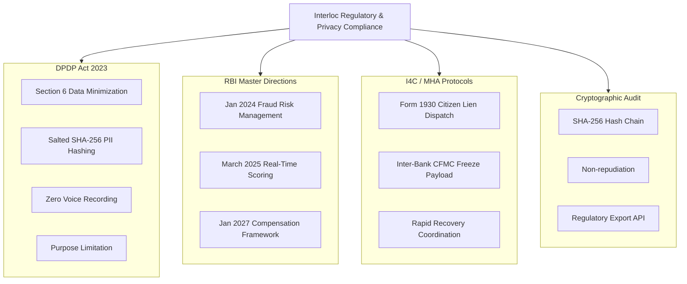
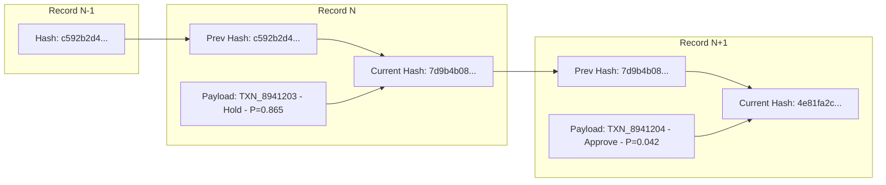

# Interloc Regulatory Compliance & Privacy Framework

## 1. Statutory Alignment Overview

Interloc is designed to comply with Indian financial regulations and data privacy laws:

---

## 2. Digital Personal Data Protection (DPDP) Act 2023

Deploying behavioral and device telemetry inside a banking switch raises serious privacy considerations. Interloc embeds strict **Privacy by Design**:

### 2.1. PII Sanitization & Salted Hashes
* Direct personal identifiers (Phone Number, Bank Account Number, Customer Name, VPA) are never logged in plaintext.
* Every identifier passes through a hardware security module (HSM) salted SHA-256 digest:
  $$\text{SaltedHash} = \text{SHA-256}(\text{PII} \parallel \text{BankSecretSalt})$$
* On the fraud operations console, account numbers and VPAs are masked using deterministic privacy masks:
  - Phone: `+91 98****3210`
  - VPA: `fa****ces@okaxis`

### 2.2. Zero Voice / Content Surveillance
* Interloc **never intercepts, records, or analyzes voice audio, keystroke text, or SMS content**.
* Telemetry consists strictly of binary hardware status flags supplied by the mobile OS accessibility API:
  - `active_call_in_progress`: Boolean (`true/false`)
  - `screen_sharing_utility_active`: Boolean (`true/false`)
  - `typing_speed_cadence`: Normalized scalar ($WPM$ and variance)
* This strictly adheres to **Purpose Limitation (Section 5)** and **Data Minimization (Section 6)** under the DPDP Act.

---

## 3. RBI Master Direction on Fraud Risk Management

Interloc directly operationalizes the requirements of RBI’s updated circulars:
1. **Real-Time Automated Screening for High-Risk Channels**:
   - Mandates that push payment channels (UPI/IMPS) evaluate risk prior to release of funds, avoiding post-facto fraud reporting delays.
2. **Documented Explainability (Non-Arbitrary Denial of Service)**:
   - A bank cannot deny a customer's right to transfer money based on a black-box heuristic.
   - Interloc’s **SHAP-based attribution trail** provides an auditable, quantifiable reason for every soft-hold or block (e.g., *"Coercion signal: Call Duration + New Payee Spike accounted for 72% of risk weight"*).
3. **Cooling-Off Period Protocol**:
   - Validates RBI’s recommended 1-hour lag on high-value transfers to newly added beneficiaries via a non-disruptive 15-minute cognitive cooling hold.

---

## 4. Cryptographic Hash-Chained Audit Ledger

To prevent internal tampering or retrospective alteration of fraud decisions, Interloc stores every evaluation in a **cryptographically linked ledger**.

### Hashing Formula:
$$\text{RecordData}_n = \text{TxnId} \parallel \text{Timestamp} \parallel \text{Decision} \parallel P_f \parallel \text{SHAP} \parallel \text{PrevHash}_{n-1}$$
$$\text{Hash}_n = \text{SHA-256}(\text{RecordData}_n)$$

* **Verification Algorithm**: Interloc includes an audit endpoint `GET /api/v1/audit/verify-chain` that traverses the ledger and confirms zero breaks or retro-modifications.

---

## 5. Automated I4C / 1930 Citizen Portal Protocol

When funds must be locked beyond the sending bank's switch, Interloc issues an automated inter-bank freeze request modeled after the **Ministry of Home Affairs Indian Cyber Crime Coordination Centre (I4C) Citizen Financial Cyber Fraud Reporting System**:
* Formatted in compliance with inter-bank lien protocols under Section 91 of the Code of Criminal Procedure (CrPC).
* Provides destination IFSC, masked account number, timestamp, and transaction reference to enable the receiving bank to place an immediate outward debit freeze before ATM withdrawal.
