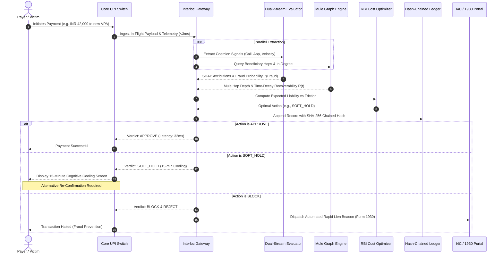

# Interloc Data Flow & In-Flight Pipeline

## 1. End-to-End Sequence Diagram

The following sequence diagram details the full lifecycle of an in-flight UPI transaction processed through the Interloc interceptor middleware.



---

## 2. Payload Specifications

### 2.1. Inbound In-Flight Transaction Payload
Sent from the bank's transaction switch or mobile app client telemetry hook to `POST /api/v1/intercept`:

```json
{
  "transaction_id": "TXN_UPI_20260911_8941203",
  "timestamp": "2026-09-11T13:45:12.104Z",
  "payer": {
    "account_id": "ACC_HDFC_9182310293",
    "vpa": "user.sharma@okhdfcbank",
    "phone": "+919876543210",
    "device_id": "DEV_SAMSUNG_S24_F1920A"
  },
  "payee": {
    "account_id": "ACC_CANARA_0921829102",
    "vpa": "fast.verify.services@okaxis",
    "ifsc": "CNRB0001928"
  },
  "amount_inr": 42500.00,
  "currency": "INR",
  "telemetry": {
    "active_call": true,
    "call_duration_seconds": 1840,
    "screen_share_active": false,
    "accessibility_service_enabled": false,
    "typing_speed_wpm": 84,
    "typing_jitter_ms": 142,
    "is_new_payee_for_payer": true,
    "transactions_in_last_10m": 1
  }
}
```

---

### 2.2. DPDP Sanitized Internal Representation
Before logging and model evaluation, the **DPDP Sanitizer** strips direct PII and hashes sensitive identifiers with cryptographic salts:

```json
{
  "sanitized_id": "TXN_UPI_20260911_8941203",
  "payer_hash": "e3b0c44298fc1c149afbf4c8996fb92427ae41e4649b934ca495991b7852b855",
  "payer_masked": "98****3210@okhdfcbank",
  "payee_hash": "a1b2c3d4e5f67890123456789abcdef0123456789abcdef0123456789abcdef0",
  "payee_masked": "fa****ces@okaxis",
  "amount_inr": 42500.00,
  "coercion_features": {
    "on_call_flag": 1,
    "call_duration_tier": "CRITICAL_LONG",
    "screen_share_flag": 0,
    "novel_beneficiary_flag": 1,
    "urgency_index": 0.88
  }
}
```

---

### 2.3. Explainable Fusion & Decision Response Payload
Returned by Interloc to the switch and logged for compliance auditing:

```json
{
  "transaction_id": "TXN_UPI_20260911_8941203",
  "latency_ms": 34.2,
  "decision": "SOFT_HOLD",
  "risk_assessment": {
    "fraud_probability": 0.865,
    "coercion_index": 0.890,
    "mule_network_index": 0.740,
    "shap_attributions": {
      "active_prolonged_call": 0.380,
      "new_beneficiary_high_amount": 0.245,
      "in_degree_burst_on_payee": 0.180,
      "typing_hesitation_jitter": 0.060
    }
  },
  "mule_chain_projection": {
    "predicted_hop_depth": 3,
    "recoverability_at_t0": 0.8865,
    "estimated_recoverability_now": 0.6420,
    "liquidity_at_risk_inr": 42500.00,
    "estimated_irrecoverable_inr": 15215.00
  },
  "expected_cost_matrix": {
    "cost_approve_inr": 3154.20,
    "cost_hold_inr": 185.00,
    "cost_block_inr": 450.00,
    "optimal_action": "SOFT_HOLD",
    "rbi_compensation_covered": true,
    "bank_direct_liability_inr": 5325.25
  },
  "friction_protocol": {
    "action": "15_MIN_COOLING_HOLD",
    "cooling_expiry": "2026-09-11T14:00:12.104Z",
    "required_reauth": "OUT_OF_BAND_BIOMETRIC_OR_TRUSTED_CONTACT",
    "concurrent_attempt_rule": "QUEUE_OR_ESCALATE"
  },
  "audit_trail": {
    "record_index": 10482,
    "previous_hash": "c592b2d4918e97a296068e59fa264e1c210d7eb276632fa55490a02ef89196b6",
    "current_hash": "7d9b4b0805a5e3f32c3f15c7e11244e8bb48291f0927eb7b686d06e2fa672153"
  }
}
```

---

### 2.4. Automated I4C / 1930 Rapid Lien Request Payload
When a high-confidence fraudulent destination is intercepted, this payload is automatically compiled for dispatch to the national cybercrime coordination switch:

```json
{
  "beacon_type": "I4C_NATIONAL_CYBER_FRAUD_RAPID_LIEN",
  "originating_bank_ifsc": "HDFC0000123",
  "beneficiary_details": {
    "target_bank_ifsc": "CNRB0001928",
    "account_number_hash": "acc_salt_0921829102",
    "target_vpa": "fast.verify.services@okaxis"
  },
  "source_transaction": {
    "txn_id": "TXN_UPI_20260911_8941203",
    "amount_inr": 42500.00,
    "timestamp": "2026-09-11T13:45:12.104Z"
  },
  "lien_instructions": {
    "action": "TEMPORARY_OUTWARD_DEBIT_FREEZE",
    "validity_hours": 24,
    "statutory_authority": "Section 91 CrPC / I4C CFMC Inter-Bank Protocol"
  }
}
```
