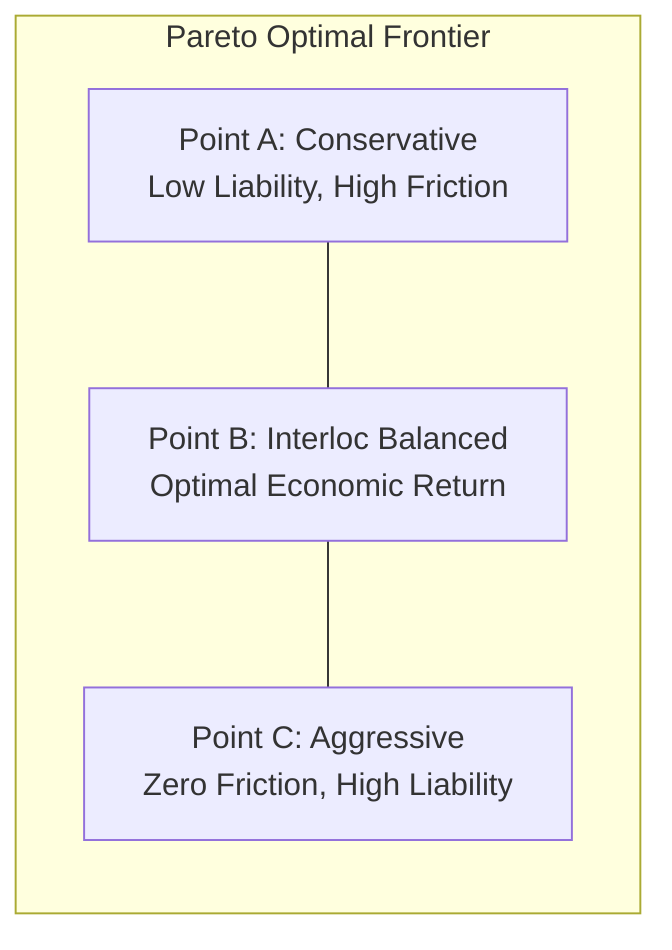

# Interloc Decision Engine & Mathematical Formulations

## 1. The Core Economic Dilemma

In Authorised Push Payment (APP) fraud, payment switches face an asymmetric economic dilemma:
1. **Under-blocking Fraud**: Results in direct regulatory compensation payouts and balance-sheet write-offs under new RBI guidelines.
2. **Over-blocking Legitimate Users**: Generates customer friction, transaction abandonment, merchant dissatisfaction, and long-term customer churn.

Interloc replaces heuristic thresholding (e.g. `if score > 0.8 block`) with an **Expected Financial Cost Minimization Engine** grounded in published RBI regulations and empirical recovery physics.

---

## 2. RBI Digital Fraud Compensation Framework

Under the Reserve Bank of India’s finalized framework for digital fraud compensation (scheduled for Jan 1, 2027 enforcement):
* **Eligibility Cap**: Valid only for fraud amounts up to $₹50,000$. Transactions $> ₹50,000$ fall outside the automatic compensation cap and require post-facto police/legal investigation.
* **Maximum Reimbursement**: $85\%$ of net financial loss or $₹25,000$, whichever is lower.
* **Apportionment of Payout**:
  - The **RBI Central Fraud Mitigation Fund** absorbs $65\%$ of the payout.
  - The **Sending/Receiving Banks** split the remaining $35\%$. For the sending (originating) bank failing to catch coercion, the direct liability is:
    $$\text{BankShare} = 35\% = 0.35$$

### Mathematical Formulation of Bank Liability
Let $L$ denote the transaction amount (loss in $\text{INR}$):

$$\text{GrossComp}(L) = \begin{cases} \min(0.85 \times L, 25000) & \text{if } L \le 50000 \\ 0 & \text{if } L > 50000 \end{cases}$$

$$\text{Liability}_{\text{bank}}(L) = 0.35 \times \text{GrossComp}(L)$$

#### Illustrative Examples:
| Transaction Loss ($L$) | Gross Compensation | RBI Absorbs ($65\%$) | Bank Direct Liability ($35\%$) |
|---|---|---|---|
| $₹10,000$ | $₹8,500$ | $₹5,525$ | $\mathbf{₹2,975}$ |
| $₹25,000$ | $₹21,250$ | $₹13,812.50$ | $\mathbf{₹7,437.50}$ |
| $₹45,000$ | $₹25,000$ (capped) | $₹16,250$ | $\mathbf{₹8,750}$ |
| $₹75,000$ | $₹0$ (cliff exceeded) | $₹0$ | $\mathbf{₹0}$ (Litigation risk) |

> **Regulatory Note**: The $₹50,000$ cliff creates a vital operational insight: sophisticated fraudsters intentionally structure payments into chunks below $₹50,000$ (smurfing) to maximize the victim's willingness to transfer without immediate high-value scrutiny.

---

## 3. Time-Decay Mule Chain Recoverability Model

When illicit funds leave the victim's account, they propagate through a directed network of money mules:
$$\text{Victim} \xrightarrow{h=1} \text{Mule}_1 \xrightarrow{h=2} \text{Mule}_2 \xrightarrow{h=3} \text{Mule}_3 \dots \xrightarrow{\text{Cash-out}} \text{ATM / Crypto}$$

Empirical data published by the **Cyber Fraud Mitigation Centre (CFMC)** and Uttar Pradesh Police demonstrated that rapid inter-bank intervention within minutes of a scam raised recovery rates from $24.56\%$ to $88.65\%$.

### Dynamic Recoverability Function
We model recoverability $R(t, h) \in [0, 1]$ as a joint continuous time-decay and discrete hop-leakage function:

$$R(t, h) = R_0 \cdot \exp(-\lambda \cdot t) \cdot (1 - \delta)^h$$

Where:
* $R_0 \approx 0.8865$ (Maximum baseline recovery efficiency at $t=0$).
* $t \ge 0$: Elapsed time in seconds since transaction initiation.
* $h \in \{1, 2, 3, 4, 5\}$: Current predicted hop depth in the mule network.
* $\lambda \approx 0.0231 \text{ s}^{-1}$: Continuous time decay constant (calibrated to a half-life of $\approx 30$ seconds for on-ward IMPS transfers).
* $\delta \approx 0.22$: Inter-hop leakage factor (representing commission kept by intermediate mule account holders).

#### Recoverability vs. Elapsed Time ($h=1$):
```
Recoverability R(t)
100% |  *** (R0 = 88.65%)
 80% |     **
 60% |       **
 40% |         *** (T+30s: ~44%)
 20% |            **** (T+60s: ~22%)
  0% +-----------------------------
     0s   15s   30s   45s   60s   90s
```

---

## 4. Customer Friction & Churn Cost Modeling

When a legitimate transaction is subjected to step-up friction (e.g. a 15-minute cooling hold) or erroneously blocked, the bank incurs customer friction cost:

$$C_{\text{friction}} = P_{\text{abandon}} \cdot \text{Margin}_{\text{txn}} + P_{\text{churn}} \cdot \text{CLV}$$

Where:
* $P_{\text{abandon}}$: Probability that the user abandons the transfer ($0.05 \text{ to } 0.15$).
* $\text{Margin}_{\text{txn}}$: Interchange / banking fee margin on the transfer ($\approx ₹2.50$).
* $P_{\text{churn}}$: Probability that a frustrated legitimate user switches their primary UPI handle or banking provider ($\approx 0.002$).
* $\text{CLV}$: Customer Lifetime Value ($\approx ₹15,000 \text{ to } ₹25,000$ for an active digital banking client).

In practice, for standard UPI push payments:
* **Cost of Soft Hold (Friction Cost)**: $C_{\text{hold}} \approx ₹120 \text{ to } ₹250$ (moderate annoyance, low churn).
* **Cost of Hard False Block (False Positive Cost)**: $C_{\text{block}} \approx ₹600 \text{ to } ₹1,500$ (high annoyance, customer support call center cost, churn risk).

---

## 5. Expected Financial Cost Matrix

For each in-flight transaction with amount $L$, fraud probability $P_f = P(\text{Fraud})$, and predicted hop recoverability $R(t, h)$:

### 1. Cost of Approval:
$$\mathbb{E}[\text{Cost}_{\text{approve}}] = P_f \cdot (1 - R(t, h)) \cdot \text{Liability}_{\text{bank}}(L)$$
*(If approved and it's fraud, unrecovered funds lead to direct bank liability payouts).*

### 2. Cost of Soft Hold (15-Minute Step-Up):
$$\mathbb{E}[\text{Cost}_{\text{hold}}] = (1 - P_f) \cdot C_{\text{hold}} + P_f \cdot \epsilon_{\text{leakage}}$$
*(If held legitimately, bank pays friction cost; if held and it's fraud, residual leakage during verification $\epsilon_{\text{leakage}}$ is negligible).*

### 3. Cost of Hard Block:
$$\mathbb{E}[\text{Cost}_{\text{block}}] = (1 - P_f) \cdot C_{\text{block}}$$
*(If blocked legitimately, bank incurs severe churn penalty; if blocked and it's fraud, zero liability is paid).*

### The Decision Rule:
$$\text{Action}^* = \arg\min_{a \in \{\text{APPROVE}, \text{HOLD}, \text{BLOCK}\}} \mathbb{E}[\text{Cost}_a]$$

---

## 6. Pareto Frontier & Dynamic Policy Tuning

Bank risk policies are not static; during high-fraud periods (e.g. festival shopping, tax season) or regulatory audits, risk executives alter their risk tolerance.



Let $\alpha \in [0, 1]$ represent the bank's **Friction Aversion Factor**:
$$\text{Objective}(\alpha) = \min \left[ (1 - \alpha) \cdot \sum \text{Retained Liability} + \alpha \cdot \sum \text{Friction Cost} \right]$$

By adjusting $\alpha$ via the **Pareto Tuning Slider** in the Interloc console, the decision boundaries automatically adapt in real time across the entire transaction stream.
