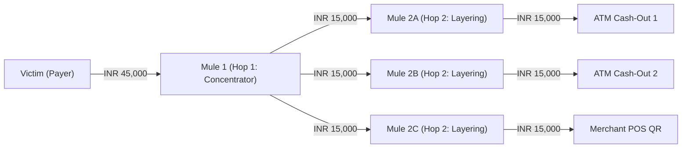
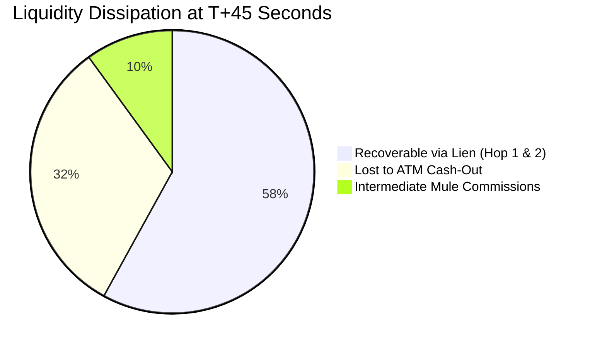
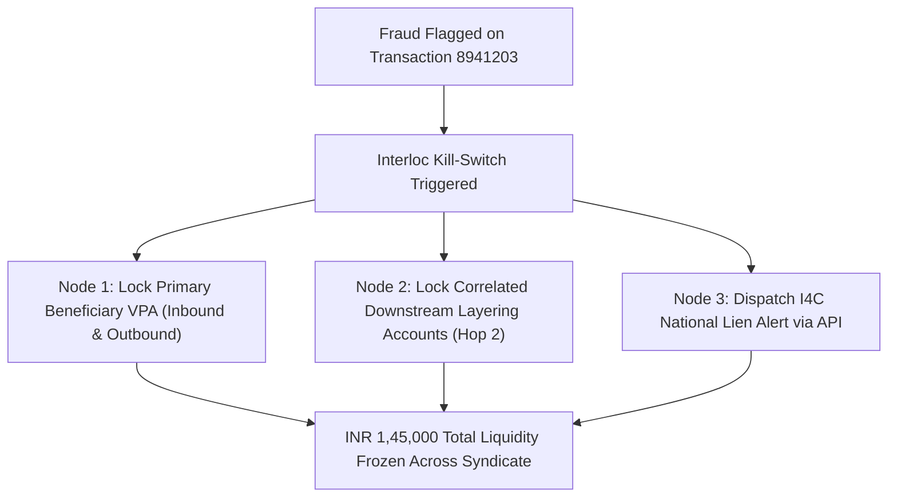

# Interloc Mule-Chain Graph & Liquidity Dissipation Model

## 1. The Mule Network Problem in Indian UPI

In modern Authorised Push Payment (APP) fraud, attackers rarely withdraw funds directly to their personal bank accounts. Instead, they leverage organized **mule rings** comprising:
1. **First-Hop Concentrators**: Dormant or newly opened accounts rented from vulnerable individuals.
2. **Intermediate Layering Hops**: Multiple sub-accounts that split transactions (fan-out) to evade anti-money laundering (AML) threshold triggers.
3. **Exit Nodes (Cash-Out Nodes)**: Pre-arranged ATM debit cards or instant merchant QR codes that convert electronic funds into untraceable cash.

---

## 2. Dynamic Graph Topology & Representation

Interloc models payment activity as a dynamic, directed multigraph:
$$G = (V, E, W, T)$$

* $V$: Set of bank accounts / VPAs.
* $E \subseteq V \times V$: Directed payment edges.
* $W$: Weight vector representing transfer amounts ($\text{INR}$).
* $T$: Timestamp vector representing transfer initiation and settlement times.

### Key Graph Features Computed in Real-Time:
1. **In-Degree Velocity ($\text{IDV}$)**:
   $$\text{IDV}_u(\Delta t) = \sum_{e = (v, u) \in E} \mathbb{I}(t_e \in [t - \Delta t, t])$$
   *Spikes in $\text{IDV}$ indicate a sudden influx of uncoordinated payments from distinct victims.*
2. **Out-Degree Fan-Out Ratio ($\text{OFR}$)**:
   $$\text{OFR}_u = \frac{\text{Out-Degree}_u}{\text{In-Degree}_u + \epsilon}$$
   *Accounts with rapid $\text{OFR} > 3$ immediately following a high-value inflow exhibit classic layering behavior.*
3. **Dormancy-to-Burst Transition ($\text{DBT}$)**:
   $$\text{DBT}_u = \frac{\text{Volume}_{u}(\text{last 24 hours})}{\text{Average Monthly Baseline}_u + 1}$$
   *Flag accounts with zero activity over 6 months that suddenly process ₹5,00,000 in 2 hours.*

---

## 3. Louvain Community Detection for Layering Rings

To detect organized syndicates rather than isolated accounts, Interloc periodically runs modularity-based community detection:

$$Q = \frac{1}{2m} \sum_{i, j} \left[ A_{ij} - \frac{k_i k_j}{2m} \right] \delta(c_i, c_j)$$

* If a newly flagged payee belongs to a dense community cluster where $\ge 30\%$ of nodes have prior fraud liens or high DoT risk scores, the entire cluster's risk baseline is dynamically elevated.

---

## 4. Time-Decayed Liquidity Evaporation Engine

Traditional systems report a static "Total Loss". Interloc calculates the **Live Evaporating Liquidity**:
At elapsed time $t$ after payment authorization:

$$L_{\text{recoverable}}(t) = \sum_{h=1}^{H} L_h \cdot R(t, h)$$

### Evaporation Dashboard Telemetry:
* **$T+0\text{s}$ (At Interception)**: $88.65\%$ Recoverable.
* **$T+15\text{s}$**: $62.30\%$ Recoverable.
* **$T+30\text{s}$**: $44.10\%$ Recoverable.
* **$T+60\text{s}$**: $21.80\%$ Recoverable.
* **$T+120\text{s}$**: $\le 5.00\%$ Recoverable (Total Dissipation).

---

## 5. The Kill-Switch Cascade Protocol

When Interloc intercepts a high-risk payment that maps to an identified mule cluster, it triggers a **Multi-Node Kill-Switch Cascade**:

### Cascade Rules:
1. **Depth Limit**: Cascade freezes are applied up to **2 hops** downstream from the intercepted node to avoid collateral locking of innocent 3rd-party merchants.
2. **Confidence Threshold**: Only triggered when $P(\text{Fraud}) \ge 0.85$ and Mule Network Index $\ge 0.80$.
3. **Audit Trail**: Every frozen node in the cascade is logged with the root triggering transaction ID in the cryptographic audit ledger.
