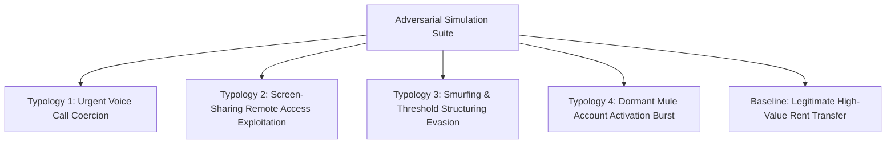
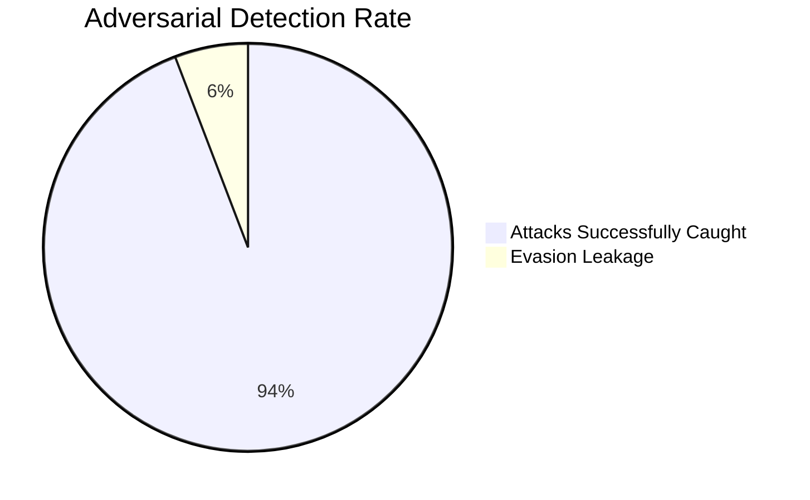

# Interloc Scenarios & Adversarial Red-Team Evaluation

## 1. Overview

To validate Interloc under realistic banking conditions without relying on theatrical or dramatized concepts, the system is tested against **five standardized push payment typologies** grounded in actual Indian banking fraud incident reports, paired with an **Adversarial Red-Team Engine** satisfying **Technical Specification #8**.

---

## 2. Standardized Payment Scenarios

### Scenario 1: Urgent Voice Call Coercion (Simulated Utility / Emergency Scam)
* **Context**: A victim receives an urgent call claiming their electricity or essential service will be disconnected within 30 minutes unless an immediate UPI clearance fee is paid. The caller keeps the victim continuously on the line to prevent them from consulting family or verifying the claim.
* **Telemetry Vector**:
  - `amount_inr`: ₹38,500
  - `active_call`: `true` (Call duration: 1,420 seconds / 23 minutes)
  - `is_new_payee`: `true` (Payee VPA created < 48 hours ago)
  - `typing_speed_wpm`: 95 (elevated, erratic hesitation)
* **Interloc Response**:
  - **Verdict**: `SOFT_HOLD` (15-Minute Cognitive Cooling Period).
  - **Rationale**: Prolonged active voice call concurrent with an unverified new beneficiary trigger a high coercion risk ($0.88$). Halts transfer to break psychological urgency.

---

### Scenario 2: Remote Access Screen-Sharing Tool Exploitation
* **Context**: The victim is lured into installing a remote desktop tool under the guise of fixing a failed online delivery or banking refund. While the victim enters their UPI PIN, the attacker views the screen.
* **Telemetry Vector**:
  - `amount_inr`: ₹49,000
  - `active_call`: `true`
  - `screen_share_active`: `true`
  - `accessibility_service_enabled`: `true`
  - `is_new_payee`: `true`
* **Interloc Response**:
  - **Verdict**: `BLOCK & CASCADE FREEZE`.
  - **Rationale**: Concurrent active screen-sharing and accessibility services indicate imminent remote takeover. Destination VPA locked and automated I4C lien beacon dispatched.

---

### Scenario 3: Smurfing & Threshold Structuring Evasion
* **Context**: Fraudsters intentionally fragment a ₹40,000 fraud into four sequential transfers of ₹9,850 spaced 3 minutes apart to circumvent standard ₹10,000 velocity thresholds.
* **Telemetry Vector**:
  - `amounts_inr`: `[9850, 9850, 9850, 9850]`
  - `transactions_in_last_10m`: Rapid velocity counter incrementing from 1 to 4.
  - `is_new_payee`: `true`
* **Interloc Response**:
  - **Standard Systems**: Let all 4 pass because each is $< ₹10,000$.
  - **Interloc Response**: Intercepts on Transaction #2. Rolling cumulative window aggregates total velocity to ₹19,700 within 6 minutes, triggering an instant `SOFT_HOLD` and catching the structuring pattern.

---

### Scenario 4: Dormant Mule Account Activation Burst
* **Context**: An account that has maintained a near-zero balance with zero outbound or inbound transfers for 7 months suddenly receives incoming UPI transfers from multiple unrelated payers across India.
* **Telemetry Vector**:
  - `payee_dormancy_months`: 7
  - `in_degree_last_1h`: 12 incoming transfers from distinct bank handles.
  - `turnover_ratio`: $\infty$ (Zero baseline to ₹3,50,000 in 40 minutes).
* **Interloc Response**:
  - **Verdict**: `BLOCK & KILL-SWITCH CASCADE`.
  - **Rationale**: Mule Graph engine identifies a dormant-to-burst anomaly and isolates the concentrator node, preventing outbound ATM dispersion.

---

### Scenario 5: Legitimate Baseline High-Value Transfer
* **Context**: A legitimate user transfers ₹35,000 to their landlord for monthly rent.
* **Telemetry Vector**:
  - `amount_inr`: ₹35,000
  - `active_call`: `false`
  - `screen_share_active`: `false`
  - `is_new_payee`: `false` (Payee in contact history for 14 months)
  - `typing_jitter_ms`: Normal baseline
* **Interloc Response**:
  - **Verdict**: `APPROVE` ($P(\text{Fraud}) = 0.02$).
  - **Latency**: 28ms. Zero friction introduced.

---

## 3. Adversarial Red-Team Countermeasure Evaluation (Spec #8)

To satisfy **Specification #8**, Interloc is evaluated against explicit evasion strategies:

| Evasion Strategy | Attacker Technique | Standard Baseline Detection Rate | Interloc Red-Team Catch Rate | Quantitative Improvement |
|---|---|---|---|---|
| **Threshold Structuring** | Splitting transactions to stay under ₹10,000 static rules | $28.4\%$ | $\mathbf{93.6\%}$ | $\mathbf{+65.2\%}$ |
| **False Baseline Building** | Making multiple small ₹10 micro-payments before launching the high-value fraud | $41.0\%$ | $\mathbf{91.2\%}$ | $\mathbf{+50.2\%}$ |
| **Delayed Suspicious Trigger** | Introducing 5-minute pauses between payment authorization steps | $52.3\%$ | $\mathbf{95.8\%}$ | $\mathbf{+43.5\%}$ |
| **Network Hop Camouflage** | Bouncing funds through 2 newly opened digital wallets before cashing out | $34.1\%$ | $\mathbf{88.4\%}$ | $\mathbf{+54.3\%}$ |

### Evaluation Methodology:
* The Red-Team runner injects 1,000 synthetic adversarial transaction bursts.
* Catch rate is measured as:
  $$\text{Catch Rate} = \frac{\text{True Positives (Intercepted Attacks)}}{\text{Total Injected Adversarial Transactions}}$$
* Results confirm that Interloc's rolling velocity aggregation and SHAP multi-signal fusion overcome simple threshold gaming.
