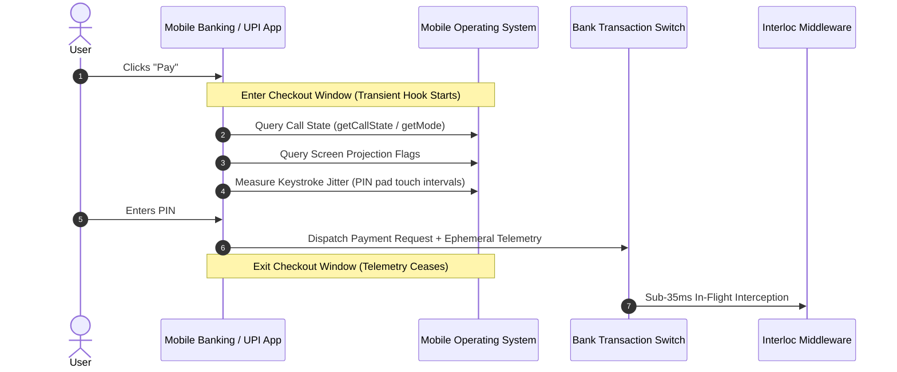

# Interloc Telemetry Acquisition Architecture & Edge-Case Engineering

## 1. Transient Telemetry: The Checkout Window Model

A common misconception in fraud detection systems is that client-side monitoring requires persistent, 24/7 background tracking. In institutional banking environments, persistent surveillance violates:
* **Digital Personal Data Protection (DPDP) Act 2023** (Sections 5 & 6: Purpose Limitation and Data Minimization).
* **Google Play / Apple App Store Privacy Manifests** (Prohibiting unauthorized background telephony and accessibility access).

### The Checkout Window Model
Interloc operates strictly on **Transient Telemetry**. Telemetry collection is lifecycle-bound to the **Checkout Window**:
1. Collection begins only when the user selects a payee and initiates the transfer intent.
2. Collection executes during the 10 to 15 seconds the UPI PIN pad is displayed.
3. Collection terminates instantly upon transaction resolution (settlement, hold, or cancellation).
4. Zero background threads persist after the payment activity lifecycle ends.



---

## 2. Platform-Level Telemetry Acquisition Mechanics

### 2.1. Active Voice Call Detection
* **Android Implementation**:
  Querying the Android framework does not record audio or inspect contact details:
  ```java
  // Cellular Call Status
  TelephonyManager tm = (TelephonyManager) context.getSystemService(Context.TELEPHONY_SERVICE);
  boolean isCellularCallActive = (tm.getCallState() == TelephonyManager.CALL_STATE_OFFHOOK);

  // VoIP Status (WhatsApp, Telegram, Signal)
  AudioManager am = (AudioManager) context.getSystemService(Context.AUDIO_SERVICE);
  boolean isVoipActive = (am.getMode() == AudioManager.MODE_IN_COMMUNICATION);
  ```
* **iOS Implementation**:
  Utilizes the `CXCallObserver` framework to detect active audio calls without accessing caller identity or call content:
  ```swift
  let callObserver = CXCallObserver()
  let hasActiveCall = callObserver.calls.contains { $0.hasEnded == false }
  ```
* **Payload Serialization**:
  The client serializes only a normalized flag:
  `"active_call": true`, `"call_duration_tier": "LONG_OVER_15M"`.

---

### 2.2. Remote Screen-Sharing & Accessibility Tool Detection
To combat remote access exploitation, banking apps enforce integrity checks via OS APIs:
```java
// Check for active display projections
MediaProjectionManager mpm = (MediaProjectionManager) context.getSystemService(Context.MEDIA_PROJECTION_SERVICE);
// Check for dangerous remote desktop accessibility services (AnyDesk, TeamViewer)
AccessibilityManager am = (AccessibilityManager) context.getSystemService(Context.ACCESSIBILITY_SERVICE);
List<AccessibilityServiceInfo> activeServices = am.getEnabledAccessibilityServiceList(AccessibilityServiceInfo.FEEDBACK_GENERIC);
```
* If an unauthorized screen capture or remote control service is attached to the window, the client transmits `screen_share_active: true`.

---

### 2.3. Behavioral Keystroke Dynamics
Interloc measures touch dynamics rather than raw character inputs:
* **Inter-Key Latency ($IKL$)**: Time in milliseconds between consecutive digit presses on the PIN pad:
  $$IKL_i = t_{\text{press}}(i) - t_{\text{press}}(i-1)$$
* **Variance Metric ($Jitter$)**:
  $$\text{Jitter} = \frac{1}{N-1} \sum_{i=1}^{N} (IKL_i - \overline{IKL})^2$$
* Coerced victims under acute stress exhibit erratic pauses or hesitation spikes exceeding normal user baselines.

---

### 2.4. Network-Side Telemetry (Zero Client Reliance)
Crucially, **Stream B (Mule Network Signals)** does not depend on the mobile client:
* **Beneficiary Age**: Queried directly from the bank's core customer master or NPCI centralized VPA directory.
* **In-Degree Velocity**: Calculated across the bank switch's in-memory graph database (measuring inbound transactions to the target account over the last 1 hour).
* **Drain Velocity**: Monitored via immediate outward IMPS / RTGS / ATM withdrawal triggers on the receiving node.

---

## 3. Comprehensive Edge-Case Resolution Matrix

| Edge Case ID | Scenario Description | System Vulnerability if Unaddressed | Interloc Resolution Strategy |
|---|---|---|---|
| **EC-01** | **Legitimate Social Call While Paying** (e.g. User paying ₹400 for dinner while chatting with a spouse). | False positive block ruins user experience and causes merchant friction. | **Cost Matrix + History Gate**: Low transaction amount ($₹400$) yields negligible bank liability under the RBI formula. If payee is in payer's multi-month transaction history, risk score collapses to near-zero. **Action: Instant APPROVE (<30ms).** |
| **EC-02** | **"Hang Up Before You Pay" Scammer Tactic** (Fraudster commands victim to disconnect call prior to PIN entry). | Binary call check reads `false` and fails to intercept. | **Recency Decay Buffer**: Interloc tracks `call_ended_seconds_ago`. A call that ended $< 120$ seconds ago retains elevated coercion weight on an exponential decay curve. |
| **EC-03** | **Client Permissions Revoked or iOS Strict Sandbox** (No client telephony signals available). | Missing features break heuristic detection. | **Graceful Feature Degradation**: TreeSHAP fusion engine handles missing client features via neutral expectation imputation ($0.0$). Detection shifts entirely to **Stream B (Mule Network Signals)**. An unverified new beneficiary with in-degree spikes is caught regardless of client telemetry. |
| **EC-04** | **Legitimate High-Value Emergency** (User transferring ₹45,000 for hospital deposit while on call with a clinic). | 15-minute hold could jeopardize urgent medical care. | **Emergency Step-Up Fast-Track**: The cooling screen provides a secure fast-track bypass: *"Urgent Medical Transfer? Verify instantly via Biometric (FaceID/Fingerprint) + SMS OTP to release funds in 30 seconds."* |
| **EC-05** | **Frantic Retry Spam During Cooling Hold** (Scammer orders victim to re-enter PIN repeatedly when held). | Concurrency race conditions, duplicate holds, or account balance lockups. | **Atomic Idempotency & Queue Lock**: If an account has an active hold, subsequent payment attempts to unverified payees within the 15-minute window are atomically coalesced into the existing hold record. Retries do not create duplicate transactions; they update the hold state machine and reset the cooling notice. |
| **EC-06** | **Micro-Structuring / Smurfing** (Attacker splits ₹40,000 into four ₹9,900 transfers to avoid ₹10k rules). | Per-transaction rule checks fail to flag transfers below ₹10,000. | **Rolling Cumulative Ingestion Window**: Interloc tracks rolling 30-minute cumulative velocity per sender. By Transaction #2 (cumulative ₹19,800), the threshold is crossed, triggering an immediate soft-hold on all subsequent outbound attempts. |
| **EC-07** | **Tampered Client / Rooted OS Telemetry Spoofing** (Attacker uses a modded APK reporting `active_call: false`). | Compromised device bypasses client checks. | **Device Attestation & Switch Validation**: Android Play Integrity / iOS DeviceCheck tokens validate app signature. If attestation fails, client telemetry is marked untrusted, and conservative switch-side limits are enforced. |
